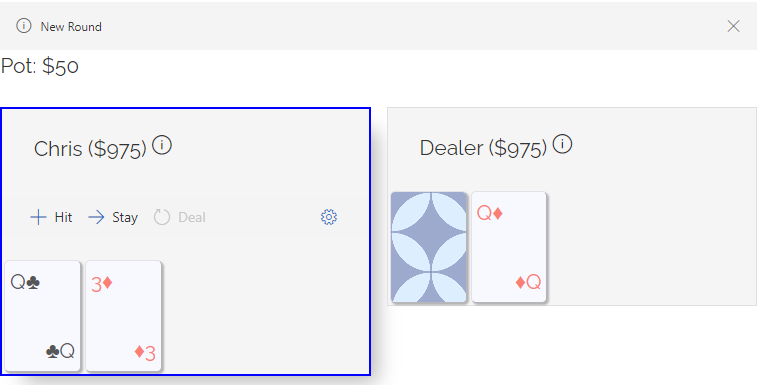

---
tags:
    - react
    - nodejs
    - javascript
    - blackjack
published: true
date: 2020-09-30T21:13:09.580Z
title: Blackjack is back
---

When I moved my site over to Gatsby a few months ago, I initially wanted to have a "clean slate" and basically start from scratch, not bringing over any content from the old site. But I missed having [my blackjack game](https://github.com/codegard1/blackjack) on this site because it is something I'm proud of and also it gives me a reason to remain engaged with JavaScript and my blog. So this week I took the time to extract the blackjack game from the old site code, clean it up, and then copy it again into the [codegard1-gatsby](https://github.com/codegard1/codegard1-gatsby) repo. I'm honestly surprised by how easy the migration was- apparently I did a good job of keeping my game code isolated from the rest of the site code.

You can access blackjack from the left-hand menu or <https://codegard1/blackjack>. Do not attempt to use Internet Explorer to play the game.

I used this project as an excuse to teach myself React and Flux, and hone my programming skills back in 2017. I chose blackjack because the rules are simple and the dealer's behavior is typically algorithmic (e.g. always hit on a soft 17).\
\
Admittedly this is not a fully-functional game of blackjack but more of a tech demo. A lot of features that you would expect are missing, and the "money" you bet on each hand has no purpose other than to create some sense of progression. \
\
I would like to put more work into this, to flesh out some of the inchoate features and make it more fun to actually play (I would love for it to be able to track your play stats across multiple sessions, for example), and also to learn about the new features in React 17.

