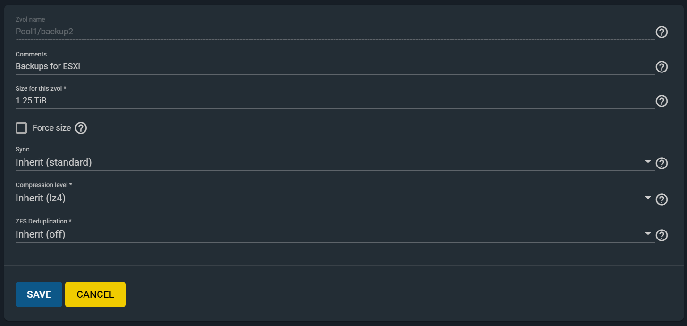
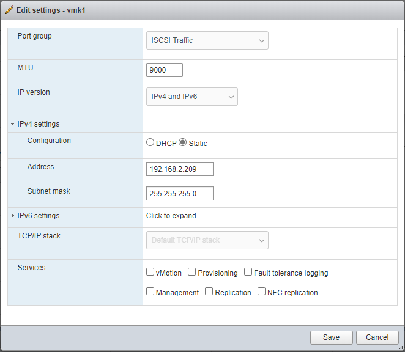

---
tags:
  - freenas
  - esxi
published: true
date: 2020-06-03T17:10:15.641Z
title: Connect ESXi Host Directly to FreeNAS
---

I have two servers: an ESXi host running several VMs and a FreeNAS server for backup storage. Each one has two physical NIC's.

Goal: establish a network between the two hosts that is strictly for ISCSi traffic between ESXi and a ZFS volume on FreeNAS

## Create a ZFS on FreeNAS

1. From the FreeNAS web UI, open Storage > Pools > Add
2. Create a new ZFS volume called "backup2" (figure 1)

## Configure Second NIC on FreeNAS

1. From the FreeNAS web UI, open Network > Add
2. Configure the second NIC with an IP address on a different network from the primary interface (figure 2)

   DHCP: No

   Autoconfigure IPv6: Yes

   IP Address: (e.g.) 192.168.3.200

## Configure iSCSI for backup2

1. From the FreeNAS web UI, open Sharing > Block Shares (ISCSI)
2. Create a new portal group or edit the existing one to include the IP address of the secondary NIC (figure 3) and Save
3. Create an initiator for ESXi, using the expected IP address of the ESXi host's second NIC
4. Create an iSCSI Target called "backup2" that uses the portal group from step 2 and the initiator from step 3
5. Create an extent for the "backup2" zvol
6. Create an associated target that connects the backup2 target with the backup2 extent. Set the LUN ID to an otherwise unused number

## Configure Second NIC on ESXi

1. Create a Virtual Switch for iSCSI using the unused NIC
2. Create a new Port Group for iSCSI, VLAN ID 0
3. Create a new VMKernel w/ the iSCSI Switch and the iSCSI Port Group

   IP: 192.168.2.201

   IPv^ Autoconfigure: Yes

   No Services

## Connect ESXi to the backup disk on FreeNAS through iSCSI

1. From the ESXi host, navigate to Storage > Adapters
2. Click "Software iSCSI" and enter the IP address of the second NIC on the FreeNAS server as a Dynamic Target, then click "Save Configuration" and wait a few moments for the ESXi host to initiate a connection to the FreeNAS host
3. Rescan and Refresh adapters, then click "Software iSCSI" again. Now, if the configuration is correct, the Freenas host will appear in the "Static Targets" section of the form.
4. You should also now see the FreeNAS iSCSI disk appear on the "devices" tab of the Storage control panel.

   If it says "Normal, Degraded" under the Status column, this is because there is not a redundant network connection to the iSCSI host. Adding a second uplink to the vSwitch that services iSCSI would resolve this issue, but otherwise it should be fine in normal home lab circumstances.

5. You should also see the backup2 disk on the Datastores tab of the Storage control panel.

   Now you can browse the disk from the ESXi web interface and use it to store VM images, hard disks, and other resources.

ESXi has no knowledge of the state of the FreeNAS server so you must be conscious of when ESXi is using resources located on FreeNAS. If FreeNAS shuts down or the connection with ESXi is lost unexpectedly, active VM's on ESXi will continue to run in an error state and data loss may occur.

As long as ESXi is not using resources on FreeNAS is it acceptable to shut down the FreeNAS server. ESXi will show error messages as it can no longer reach the iSCSI host, but they will go away once the connection is re-established.
