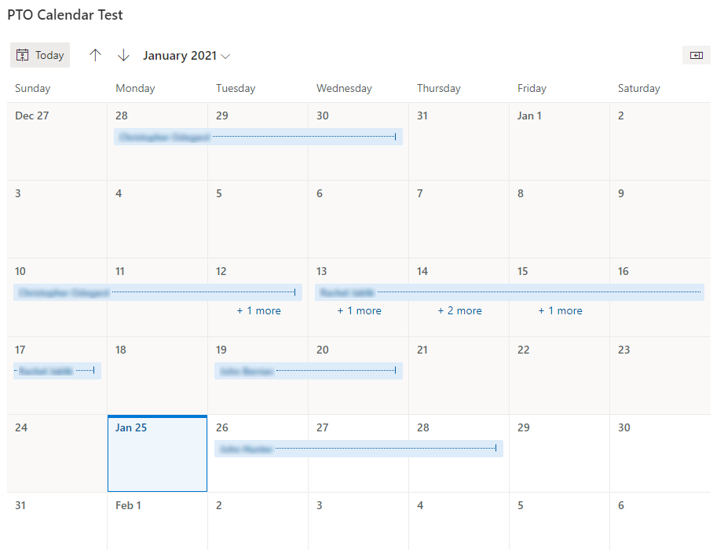
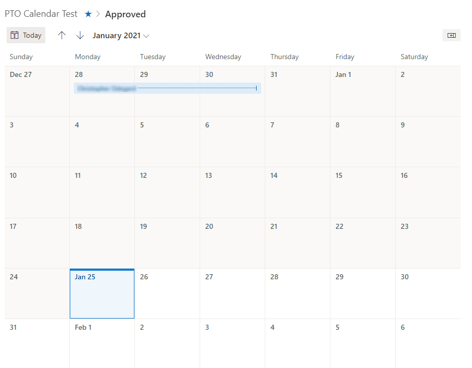

---
tags:
  - sharepoint
published: true
date: 2021-01-25T21:47:19.382Z
title: Filtering SharePoint Modern Calendar View
---

A few months ago Microsoft started rolling out a modern version of the beloved calendar view for lists in SharePoint Online. The modern view is a great improvement in some respects, but it does not seem to permit filtering of the items that appear in the list except by using the ad-hoc filter panel (which is woefully inadequate compared to the "classic" filters). So a lot of people are asking how to filter this type of view. Supposedly Microsoft is "working on a fix for this", but that doesn't mean much.

I have found that you can filter the Modern Calendar view with URL parameters. It's not ideal but provides some kind of workaround. YMMV.

The relevant parameters are:

- **useFiltersInViewXml** (=1)
- **FilterField1** (=Internal name of the column to filter by)
- **FilterValue1** (=Value to filter by)

Obviously this works best with text/numeric fields, but you can also filter by lookup fields or managed metadata with the use of additional params (see link below for more information).

So for example, if I have a PTO Calendar using the Modern Calendar View I can filter out "Pending" requests with this URL:

```
https://<tenant>.sharepoint.com/<site>/Lists/PTOCalendar/ModernCalendar.aspx?useFiltersInViewXml=1&FilterField1=ApprovalStatus&FilterValue1=Approved
```

In the first screenshot the list is unfiltered. In the second screenshot we only see items where `ApprovalStaus` = "Approved".





See Also: [Generate Modern List Filter URL: Managed Metadata – Piyush K Singh](https://piyushksingh.com/2019/05/24/generate-modern-list-filter-url-managed-metadata/)
