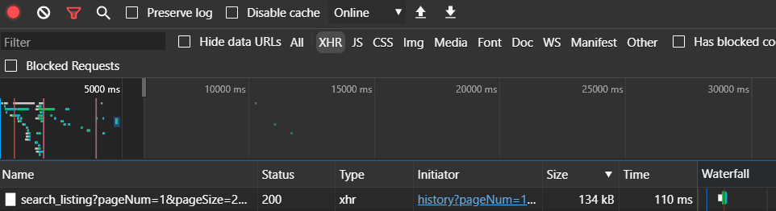
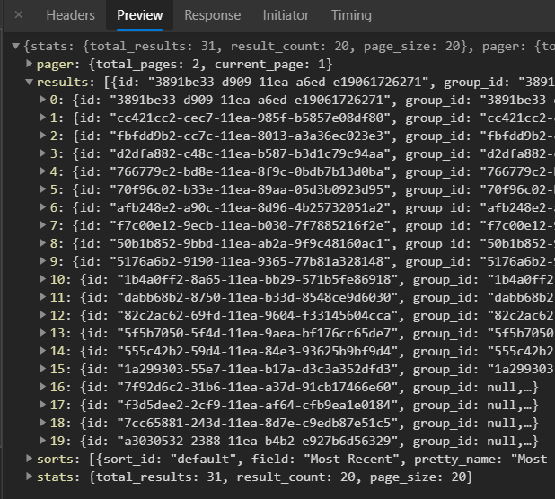

---
tags:
  - json
  - grubhub
  - api
published: true
date: 2020-08-12T01:24:56.598Z
title: Get Grubhub order history as JSON
---

The other day I tried to download my GrubHub order history as JSON.

Some cursory research led me to determine that they do not have a publicly-accessible API, and only partner organizations are given keys to use it.

So the next best thing is snooping on the site traffic using Developer Tools in Edge. Sure enough, on the "Past Orders" page, you can see the API calls by filtering network traffic by XHR. Evidence of a REST API is present in the site code, but it is not readily obvious how to format and execute a customized API call.

The GubHub website is a Progressive Web App so it makes a lot of XHR's, but the largest one is associated with the JSON object that holds your history data:

Selecting this XHR shows a preview of the data:

To make use of this object, select the "Response" tab, select the entire string, and then paste it into a file or IDE for parsing.

This method is fairly straightforward but the default is to return only 20 items at a time. You can increase the number of history items returned by changing the **pageSize** parameters in the page URL:

https://www.grubhub.com/account/history?pageNum=1&**pageSize=20**&facet=scheduled%3Afalse&facet=orderType%3AALL&sorts=default

In my experience, you can increase the number arbitrarily, but the site will only return data for the past year of activity, even if you have been using GrubHub for longer. This may be intentional on the part of the developers, or maybe I'm missing something.

In any case, the JSON object here is highly nested and contains a lot of details, including restaurant name, the names and prices of what was ordered, and what payment method was used, etc. etc.
