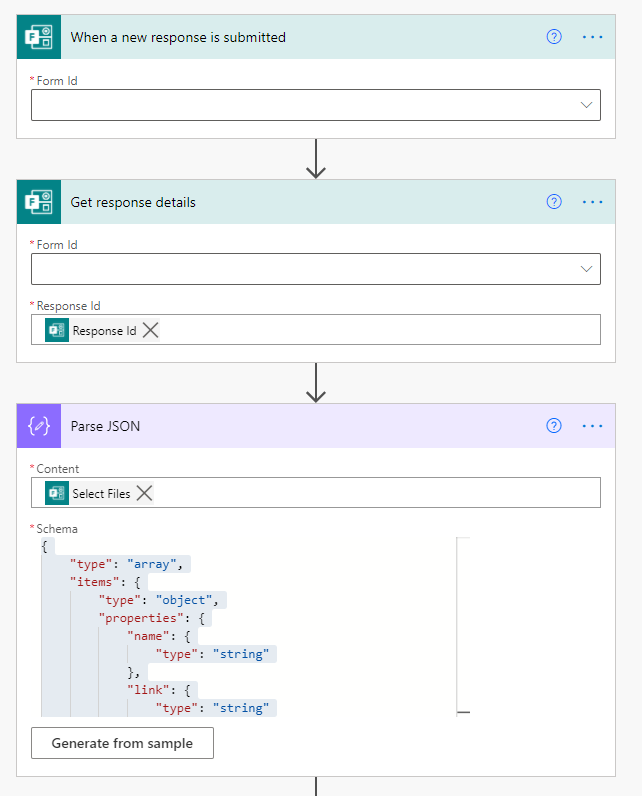
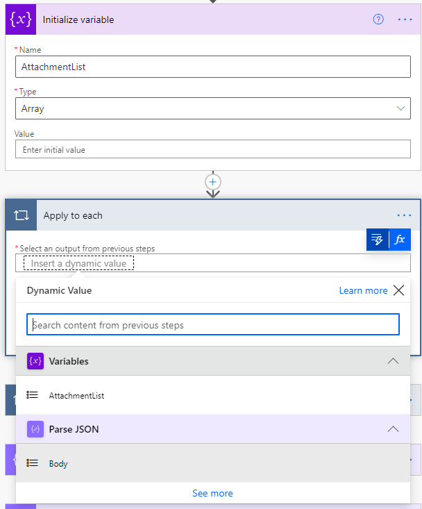
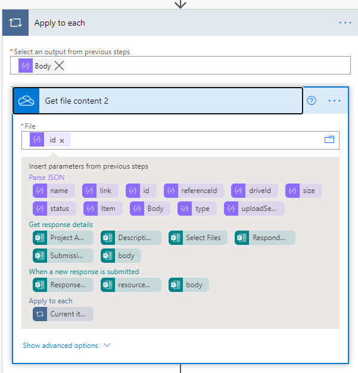
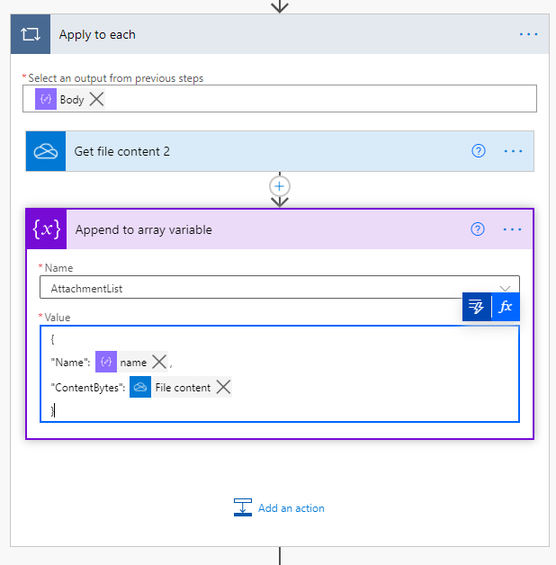
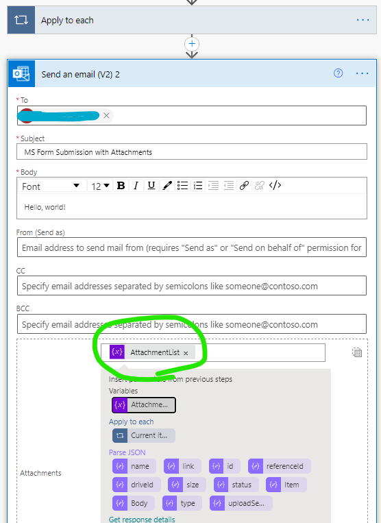
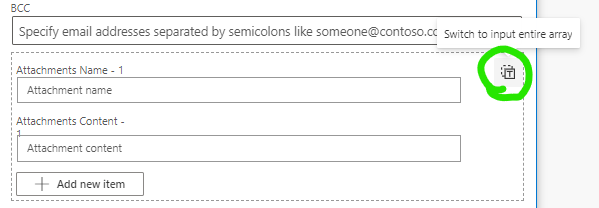

---
tags:
  - powerautomate
  - microsoft
  - office365
published: true
date: 2021-03-24T17:18:28.811Z
title: Get MS Form attachments in Power Automate
---

This post describes how to use Power Automate to get files uploaded using MS Forms and send them as attachments to an email.

Start the flow with a "When a new response is submitted" trigger for MS Forms.

First, get the response details for the response that triggered the flow.

Then do **Parse JSON** on the form question that allows attachments. In this case the question title is "Select Files".

Use the output from **Get Response Details** as a sample to generate the schema for Parse JSON. I used the below schema:

```json
{
  "type": "array",
  "items": {
    "type": "object",
    "properties": {
      "name": {
        "type": "string"
      },
      "link": {
        "type": "string"
      },
      "id": {
        "type": "string"
      },
      "type": {},
      "size": {
        "type": "integer"
      },
      "referenceId": {
        "type": "string"
      },
      "driveId": {
        "type": "string"
      },
      "status": {
        "type": "integer"
      },
      "uploadSessionUrl": {}
    },
    "required": [
      "name",
      "link",
      "id",
      "size",
      "referenceId",
      "driveId",
      "status"
    ]
  }
}
```



Next, initialize a new Array variable.

Then, add an **Apply to Each** control and as input select the output from the **Parse JSON** action above.



Add a **Get File Content** action. (Use the OneDrive-flavored one since the files attached to MS Forms are stored in OneDrive by default.)

Pass in the id value from the **Parse JSON** action.



Next, add an **Append to array** action and specify the array we initialized earlier.

In the Value field, define an object with "Name" and "ContentBytes" properties. "Name" comes from the output of Parse JSON and ContentBytes comes from the output of **Get File Content**.

```json
{
  "Name": @{items('Apply_to_each')?['name']},
  "ContentBytes": @{outputs('Get_file_content')?['body']}
}
```



Finally, add a **Send an Email** action after the **Apply to Each** loop.

In the email "Attachments" parameter, click on the little button in the upper right labeled "Switch to input entire array", then specify the array variable containing attachment files' names and content.



Here is another screenshot of the "Switch to input entire array" button.


