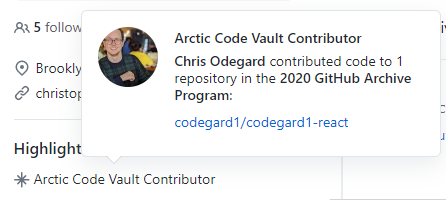

---
tags:
    - github
published: true
date: 2020-08-12T18:33:17.139Z
title: I'm in the Arctic Vault
---

I just noticed today that I have an [Arctic Code Vault Contributor](https://github.community/t/earning-the-github-arctic-code-vault-badge/124219) badge on my GitHub profile. Apparently an older version of my site ([codegard1-react](https://github.com/codegard1/codegard1-react)) was included in the 2020 Vault. Neat!

