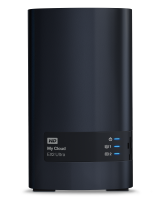

---
tags:
  - freenas
published: true
date: 2020-07-30T23:42:45.076Z
title: New NAS
---

After playing with FreeNAS for a few months I finally decided I was tired of micro-managing my backup solution. So I bought a WD NAS on sale from Amazon, the MyCloudEX2Ultra 4TB.

I've never used a commercial NAS before, so I was surprised to find out that it's basically FreeNAS lite, with many of the same features but a "dumber" interface. It even runs Plex natively, which sounds good in theory but fails as soon as you need to transcode a video.
