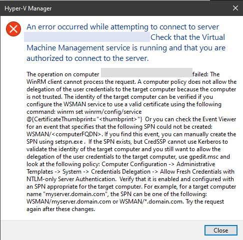

I have a Hyper-V host running on an ESXI host, so to manage the Hyper-V VM's I have to use Remote Desktop to get to the Hyper-V Host to open the management console, which is inefficient. Instead I would prefer to manage the Hyper-V host remotely, using Hyper-V Manager. The page below describes how to set this up.

Since the client (my laptop) and the Hyper-V host are both on the same domain and both run Windows 10 or Server 2016, it should be fairly easy to do this.

[Remotely manage Hyper-V hosts with Hyper-V Manager](https://docs.microsoft.com/en-us/windows-server/virtualization/hyper-v/manage/remotely-manage-hyper-v-hosts)

First we have to enable PSRemoting on both the client and server, then add the server as a trusted host in the WinRM configuration.

1. On the Hyper-V host to be managed, open a Windows PowerShell session as Administrator.
2. Create the necessary firewall rules for private network zones:

   ```powershell
   Enable-PSRemoting
   ```

3. To allow remote access on public zones, enable firewall rules for CredSSP and WinRM:

   ```powershell
   Enable-WSManCredSSP -Role server
   ```

Next, configure the computer you'll use to manage the Hyper-V host.

1. Open a Windows PowerShell session as Administrator.
2. Run these commands:

   ```powershell
   Set-Item WSMan:\localhost\Client\TrustedHosts -Value "fqdn-of-hyper-v-host"
   Enable-WSManCredSSP -Role client - DelegateComputer "fqdn-of-hyper-v-host"
   ```

3. You might also need to configure the following group policy:

   - Computer Configuration > Administrative Templates > System > Credentials Delegation > Allow delegating fresh credentials with NTLM-only server authentication
   - Click Enable and add wsman/fqdn-of-hyper-v-host.

4. Open Hyper-V Manager.
5. In the left pane, right-click Hyper-V Manager.
6. Click Connect to Server.

---

After doing the above, I tried to connect to the Hyper-V Host from my laptop and got this error:



I followed the instructions to set the "Allow Fresh Credentials with NTLM-only Server Authentication" group policy for the Hyper-V Host, and after \`gpupdate /force\` I was able to connect.
